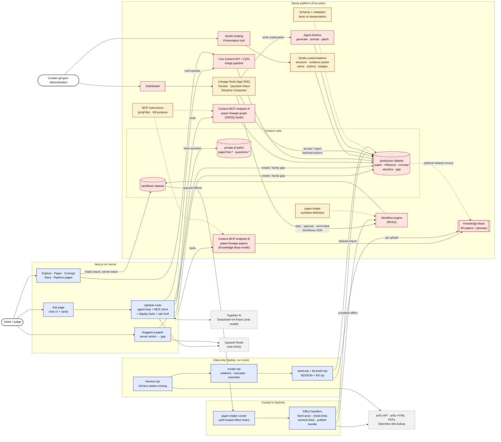

# Paper Lineage: System Architecture (v2)

> **Every idea has ancestors.** Ask a question about AI papers and get an answer drawn from an
> evidence-backed family tree of 197 papers traced back from BLIP-2. Every link is a citation fact
> mined from the paper's full text, and it only gets a relation label once a curator accepts it.

Built for the [DEV × Sanity Challenge](https://dev.to/devteam/join-the-sanity-challenge-2500-in-prizes-for-five-winners-514m). Path Two (vibe-coded app), with both bonus areas (**Workflows**, **App SDK**). The Ask agent on **Sanity Context + Knowledge Base** also fits Path One.

v2 changes: chat-first front door (Ask), Sanity Context with two MCP endpoints (GROQ + Knowledge Base), facts vs interpretations, private visitor questions feeding a curation loop, and an explicit split of who uses what.

---

## 1. Principles

1. **The map and the territory.** The *dataset* is the map: which paper built on which, queried live with GROQ. The *Knowledge Base* is the territory: what the papers actually say. An answer never mixes them up (§5).
2. **Facts are public; interpretations are earned.** A link's citation facts (count, section, sentences) are always shown. Its relation label appears only after a curator accepts it.
3. **Visitors ask; curators decide.** End users only use the website. Sanity Studio and the Lineage Desk are tools for the builders and curators (§3).
4. **Questions drive curation.** A weak answer becomes a `gap` the curators work through, and the next visitor gets a better answer.
5. **Free plan only.** Everything below runs on Sanity's Free plan (§9).

---

## 2. System diagram

**Legend:** what each box is.

| Colour | Meaning |
|---|---|
| 🟥 **Sanity: provided** | A managed Sanity product we configure but don't write (Content Lake, Context MCP, Knowledge Base, Live API, Agent Actions, Functions runtime, Dashboard) |
| 🟧 **Ours: runs on Sanity** | Our code or configuration, executed or hosted by Sanity (schema, Studio customisations, App SDK app, Function handlers, workflow definition, MCP instructions, Knowledge Base sources) |
| 🟦 **Ours: runs elsewhere** | Our code outside Sanity (Next.js site on Vercel, the Ask agent route, data-prep scripts on a laptop) |
| ⬜ **Third party** | External services we call (Together AI chat model, arXiv / ar5iv, OpenAlex, Vercel hosting) |



### Component inventory

| Component | Kind | What it does | Built with |
|---|---|---|---|
| Content Lake `production` | 🟥 Sanity | Papers, links, concepts, storylines, stats | Documents, references, GROQ |
| Private id paths `paperText.*`, `questions.*` | 🟥 Sanity | Full texts and visitor questions, not readable by public queries | Document id paths (verified: public `count(*[_type=="paperText"]) == 0`) |
| Content Lake `workflows` | 🟥 Sanity | Workflow definitions and instances | Second Free-plan dataset |
| Live Content API + CDN | 🟥 Sanity | Site reads; approvals appear without reload | `client.live.events()` → `updateTag` + `router.refresh()` |
| Context MCP **A: graph** | 🟥 Sanity, 🟧 our config | GROQ access to the lineage for the agent | Dataset source, `groqFilter`, instructions |
| Context MCP **B: papers** | 🟥 Sanity, 🟧 our config | Knowledge Base access for "how does it work" | Knowledge Base source, instructions |
| Knowledge Base | 🟥 Sanity, 🟧 our sources | Prebuilt, cited entries from 40 papers; conflicting claims flagged as issues | File source (zip), optional dataset source |
| Agent Actions | 🟥 Sanity | Desk "Write explanation" (one sentence grounded in the chosen citation sentence) | `useAgentGenerate` with `target: {path: 'explanation'}` |
| Workflow engine | 🟥 Sanity library | Stages, actions, gates and effects of `paper-intake` | `@sanity/workflow-engine` 0.36 (early access), deployed with `@sanity/workflow-cli` |
| Schema | 🟧 ours on Sanity | Facts / interpretation groups, validation, reference filters | `defineType` (deployed with `sanity schema deploy`) |
| Studio customisations | 🟧 ours on Sanity | Curator editing (§3) | Structure builder, custom inputs, views, actions |
| Lineage Desk | 🟧 ours on Sanity | Review, Inbox, Composer, Pipeline (§3) | App SDK v3, Sanity UI, Workflows SDK (`useWorkflowInstances`, `useWorkflowSession`) |
| paper-intake runner + handlers | 🟦 ours | Drains queued effects (fetch metadata, count links, publish) | `createEngine` + `drainEffects`; a hosted Blueprints runtime isn't accepted by the backend yet, and Free-plan scheduled Functions run daily |
| Next.js site | 🟦 ours | Ask + browse pages for visitors | Next.js 16, custom deterministic graph layout (no React Flow / ELK), `next/og` |
| `/api/ask` agent route | 🟦 ours | Our tool loop: Context A + B through MCP sessions (`groq_query`, `knowledge_base_search/read`), `initial_context` preloaded, **server-validated display tools** (DESIGN_SPEC §5.6), card budget, question + gap logging, rate limit | `lib/ask/agent.ts` over Together's OpenAI-compatible API, NDJSON stream |
| Suggest-a-paper action | 🟦 ours | Validates an arXiv ID and creates or bumps a `missing-paper` gap (never a paper) | Next.js server action |
| Data prep scripts | 🟦 ours | Harvest → curate → seed → KB zip | Node, ar5iv HTML, `pdftotext` |
| Chat model | ⬜ third party | Plans lookups, writes the answer, picks cards | Together AI, `deepseek-ai/DeepSeek-V4-Flash-0731` (OpenAI-compatible chat + tool calling), ≈1¢ per answer |
| Upstash Redis | ⬜ third party | Per-visitor and global daily rate limits (free tier) | `@upstash/ratelimit` |
| arXiv / ar5iv / OpenAlex | ⬜ third party | Metadata, full text, title → ID lookups | Public APIs |

---

## 3. Audiences and access

| Who | Uses | Sanity access | Notes |
|---|---|---|---|
| **Visitor** | Website only: Ask, browse, suggest a paper | None | Writes (questions, suggestions) go through the site's server token |
| **Judge** | Website; optionally the hosted Studio, read-only | Invited as **Viewer** (free, unlimited) | Can see schema, structure and inputs, but not edit |
| **Curator** | Studio + Lineage Desk | **Administrator** (the only role that can write on Free) | Small trusted team, because Administrators also control project settings |
| **Builder** | Everything + CLI | Administrator / organization admin | Deploys schema, Studio, Desk, workflow definitions |

| Credential | Lives in | Permission |
|---|---|---|
| Organization token (Context Viewer) | `web/.env.local` on the server | Read through Context MCP only |
| Project write token (narrow) | `web/.env.local` on the server | Create `question` documents, `gap` upserts, storyline drafts |
| Upstash REST URL + token | `web/.env.local` on the server | Rate-limit counters only |
| Curator login session (`sanity login`) or `SANITY_AUTH_TOKEN` | the machine running the paper-intake runner | Workflow + content writes for effect handlers |
| Read token (optional, `SANITY_READ_TOKEN`) | `web/.env.local` on the server | Reads workflow instance summaries for /pipeline (falls back to the write token) |
| Together API key | `web/.env.local` on the server | Chat model |

Studio, Desk and Context are **builder and curator tools**. The website is the only end-user surface.

---

## 4. Main flows

### 4.1 Ask (end user)

```mermaid
sequenceDiagram
  autonumber
  actor V as Visitor
  participant S as Ask page (Next.js) 🟦
  participant R as /api/ask route 🟦
  participant M as Claude ⬜
  participant G as Context MCP: graph 🟥
  participant K as Context MCP: papers (KB) 🟥
  participant L as Content Lake 🟥

  V->>S: "How does BLIP-2's Q-Former differ from Flamingo's resampler?"
  S->>R: question + conversation
  R->>M: system prompt (data contract) + tools from G and K
  M->>G: groq_query: concepts, chain, Flamingo→BLIP-2 link
  G-->>M: docs with _ids (link: cited 5×, unreviewed)
  M->>K: knowledge_base_read: blip2/q-former, flamingo/resampler
  K-->>M: entries with citations to paper sections
  M->>R: display tools: showChain / showQuote / suggestFollowUps / reportOutcome
  R->>L: resolve cards by _id (relation only if accepted)
  R->>K: re-read KB entry; quote must match verbatim
  R->>L: save questions.<uuid> (outcome, cited ids)
  R-->>S: stream answer + cards
  S-->>V: chain card 🟥data · quote blocks from papers · follow-up chips
```

### 4.2 Curation loop (curator)

```
question saved (outcome partial / unanswered)
   → /api/ask 🟦 creates or bumps a gap document in the same request
   → Lineage Desk 🟧 Question Inbox: accept links · add missing paper · write storyline
   → "Add paper" creates the paper draft and starts Workflow paper-intake 🟥/🟧 (Workflows SDK)
        fetching → checks → curation (human; approve gated on 0 unreviewed links) → publishing
   → Live Content API 🟥 updates the site; the next Knowledge Base refresh picks up curated text
```

### 4.3 Paper intake workflow

| Stage | Moved by | Work |
|---|---|---|
| fetching | effect `fetch-arxiv` (runner) | Fills a placeholder paper draft from the arXiv API; complete papers are untouched. Retries 3× |
| checks | effect `check-links` (runner) | Counts unreviewed / accepted / total links into the paper |
| curation | **Curator** (Desk Pipeline tab) | Review links in the Desk, **Re-check links**, then **Approve** (the engine refuses while any link is unreviewed) or **Send back** with a required note (→ fetching) |
| publishing | effect `publish-bundle` (runner) | Refuses if a link is unreviewed; publishes the paper draft in one transaction |

*Cut from v3:* the `enriching` stage (Agent Actions proposing links) and `verify-evidence`. Links come from the full-text harvest, and evidence is chosen by the curator with the evidence picker.

Human curation is never skipped, because lineage links are claims about history. The checks only set review priority.

---

## 5. Data contract for Ask: GROQ vs Knowledge Base

**Rule: GROQ answers *who / when / which / how many / verified?*; the Knowledge Base answers *how / why / what results*.**

| Data | GROQ (endpoint A) | Knowledge Base (endpoint B) |
|---|---|---|
| Paper metadata, dates, kinds | ✅ | — |
| Link citation facts (count, section, sentences) | ✅ | — |
| Link relation / inherited concepts / explanation | ✅ only if `accepted` | — |
| Review status, counts, rankings | ✅ | — |
| Concept tree (theme → concept, introduced by, used by) | ✅ | glossary only (vocabulary) |
| Storylines | ✅ structure | ✅ narrative (dataset source, once storylines exist) |
| Full text of 40 core papers | — (`paperText` filtered out) | ✅ |
| Visitor questions, gaps, drafts | ❌ | ❌ |

**Answer rules** (system prompt + enforced in rendering):
1. Structural claims cite a GROQ `_id`, and the UI draws them as cards and chips from that id.
2. Content claims cite a Knowledge Base entry and its paper and section. The UI draws them as quote blocks labelled "From the paper".
3. The Knowledge Base never creates links. A mention with no matching link becomes a `missing-link` gap.
4. Unreviewed links are stated as "cites n×", never with a relation.
5. If they disagree, GROQ (live) beats the Knowledge Base (last build).
6. If neither covers the question, the answer says so and a gap is logged.

---

## 6. Content model (deployed)

| Type | Id pattern | Public? | Key design |
|---|---|---|---|
| `paper` | `paper-<arxiv>` | ✅ | `uses[]` → concept. *Introduced* concepts are derived from `concept.introducedBy` (stored once) |
| `paperText` | `paperText.<arxiv>` | ❌ private path | Full text by section; kept out of `paper` so neither public queries nor the agent pull it |
| `influence` | `influence-<from>-<to>` | ✅ | Groups **Fact** (read-only `citation{…contexts[_key]}`), **Interpretation** (`relation`, `inherited`, `explanation`, `evidenceKey` → a context `_key`) and **Review** (`provenance`). Validation: time order, no self-link, no duplicates, accepted ⇒ has relation |
| `concept` | `concept-<slug>` | ✅ | `level` theme/concept, `broader` → theme (filtered), `introducedBy` → paper |
| `storyline` | free | ✅ | Steps reference **accepted** links only (reference filter). Portable Text with paper / concept / link annotations |
| `question` | `questions.<uuid>` | ❌ private path | Outcome, endpoints used, weak refs to cited papers and links, `gap` |
| `gap` | free | ✅ (curator data) | `missing-link · missing-paper · unanswered · weak-evidence`, status |
| `datasetStats`, `siteSettings` | singletons | ✅ | `siteSettings`: example prompts, start papers. Stats are computed live with `count()` (`datasetStats` is unused) |

Seeded: 197 papers, 197 full texts, 1,349 links (1,127 with a keyed evidence sentence), 25 themes + 180 concepts, 2 singletons.

---

## 7. Data pipeline (one-time, 🟦 ours)

```
arXiv metadata ⬜ ─┐
ar5iv HTML / PDF ⬜ ┼─▶ harvest.mjs ─▶ data/raw/graph.json   (229 papers, 2,684 citations)
OpenAlex lookup ⬜ ─┘        │
                             ▼
              curate.mjs + overrides.json + concepts.json
                             ▼
              data/curated/* (197 papers, 1,349 links, 205 concepts)
                  │                                  │
                  ▼                                  ▼
          seed.mjs → production.ndjson        kb-fetch.sh + kb-build.mjs
                  │ sanity dataset import           │ upload in Context app
                  ▼                                  ▼
          Content Lake 🟥                     Knowledge Base 🟥
```

---

## 8. Repository layout

```
paper-lineage/
├── web/                     🟦 Next.js site + /api/ask (Vercel)
├── studio/                  🟧 Sanity Studio: schemaTypes/, structure.ts
├── desk/                    🟧 Lineage Desk (App SDK)
├── workflows/               🟧 paper-intake definition (sanity.workflow.ts) + 🟦 runner and effect handlers
├── scripts/                 🟦 harvest, curate, seed, kb-fetch, kb-build, context-smoke
├── data/
│   ├── raw/graph.json       harvested citation graph (HTML/PDF caches git-ignored)
│   ├── curated/             papers, influences, concepts, overrides
│   ├── seed/                production.ndjson
│   └── kb/                  manifest + glossary (PDFs and zip git-ignored)
└── docs/                    ARCHITECTURE · SPEC · UX_REVIEW · CONTEXT_SETUP · BUILD_LOG
```

---

## 9. Free-plan feature map

| Used | Free allowance | Where |
|---|---|---|
| Content Lake, GROQ, references, validation | 10k docs (we use ~1,950), 250k API / 1M CDN req/mo | everywhere |
| 2 public datasets + private id paths | 2 | `production`, `workflows`; `paperText.*`, `questions.*` |
| Hosted Studio, Presentation, Visual Editing | included | curators |
| Live Content API | 1,000 connections / dataset | site |
| **Sanity Context** (MCP, GROQ mode) | included ("Agent Actions and Context") | Ask endpoint A |
| **Knowledge Bases** (beta, Labs) | plan-capped count / sources; limits may change | Ask endpoint B |
| Agent Actions | 1,000 AI credits / mo | Desk "Write explanation" |
| App SDK + Dashboard | included | Lineage Desk (deployed organization app) |
| Workflows (early access) | library on our `workflows` dataset + self-hosted runner | paper intake |
| Functions | not used | a scheduled Function runs daily on Free, too slow for intake; hosted workflow runtimes await Blueprints support |
| Not on Free → replaced | Comments, Tasks, Releases, custom roles, private datasets | send-back notes · one-transaction publish · trusted Admins · private id paths |

---

## 10. Risks

| Risk | Mitigation |
|---|---|
| Knowledge Base beta limits (the challenge post says 150 documents) | 40 PDFs + 2 files in one zip; the dataset source is optional |
| Knowledge Base build cost in AI credits | One build first; watch usage before adding the dataset source |
| Context needs an organization token | Server-only env var, Context Viewer (least privilege) |
| Chat cost / abuse on a public site | Rate limit per IP, short context, questions capped in length |
| Workflows early access (0.x) | Pinned versions; `provenance.reviewDecision` works without the engine |
| Wrong mined relations | Hidden until accepted; the Desk shows quotes and checks |
| Judges can't log in | Viewer invites, demo video, `/pipeline` |
