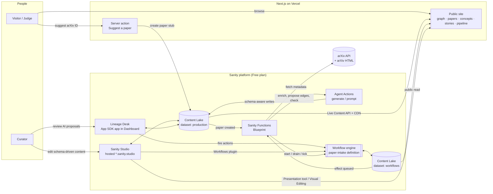
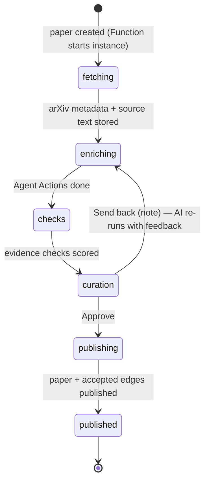

# Paper Lineage — System Architecture

> **Every idea has ancestors.** Paper Lineage is the family tree of landmark AI papers.
> Each link in the tree is a structured, evidence-backed claim. An AI agent proposes it
> and a human curator approves it, both acting through the same Sanity Workflow.

Built for the [DEV × Sanity Challenge](https://dev.to/devteam/join-the-sanity-challenge-2500-in-prizes-for-five-winners-514m), Path Two (vibe-coded app). This design reaches both bonus areas: **Workflows** and the **App SDK**.

---

## 1. Design principles

1. **Edges are content.** A lineage link is an `influence` document. It has a relation type, the concepts it carried over, an explanation, an evidence quote and provenance. It is not an untyped `cites[]` array.
2. **AI proposes, humans approve, and the workflow records both.** Every AI-made claim starts as a draft. It reaches the public site only after a person approves it in a Sanity Workflow. The public site labels each link with how it was produced.
3. **Sanity is the whole platform.** Sanity handles storage, editing, automation, AI, review and real-time delivery. There is no separate backend server.
4. **Free plan only.** Every feature used is included in Sanity's Free plan (see §6).
5. **Judges can see it without logging in.** The workflow and its audit trail are published to a public page, so nobody needs a Studio seat to see the process.

---

## 2. System overview



### Components

| # | Component | Tech | Responsibility |
|---|---|---|---|
| 1 | **Content Lake: `production`** | Sanity dataset (public) | All content: papers, influences, concepts, datasets, benchmarks, authors, orgs, storylines |
| 2 | **Content Lake: `workflows`** | Sanity dataset (public) | Workflow definitions and instances, kept apart from content queries. The Free plan allows 2 datasets |
| 3 | **Sanity Studio** | `sanity` v6.15+ (needed by the Workflows plugin), hosted | Main editing surface: custom structure, inputs, views, actions, Workflows plugin, Presentation tool |
| 4 | **Lineage Desk** | App SDK (`@sanity/sdk-react`, React 19) + `@sanity/workflow-sdk` + Sanity UI, deployed to the Sanity Dashboard | Keyboard-driven review of AI-proposed edges, with a live graph preview. **Bonus: App SDK** |
| 5 | **Workflow `paper-intake`** | `@sanity/workflow-engine` (early access, pinned 0.x) | Takes a paper from fetch → AI enrichment → checks → human curation → publish. **Bonus: Workflows** |
| 6 | **Functions** | `@sanity/functions` + `@sanity/blueprints` | Start the workflow on paper creation, drain workflow effects (arXiv fetch, Agent Actions, publish), run a daily recovery tick |
| 7 | **Agent Actions** | `client.agent.action.generate` / `prompt` | Schema-aware AI: fill summaries, insights and concept links; propose influence drafts; review evidence |
| 8 | **Public site** | Next.js (App Router) + `next-sanity` (`defineLive`), React Flow + ELK layout, TypeGen | Graph explorer, paper, concept and story pages, the public pipeline board, live updates, Visual Editing |

---

## 3. The paper intake pipeline (main flow)



| Stage | Who moves it | What happens | Sanity features |
|---|---|---|---|
| **fetching** | Agent (Function effect) | Normalise the arXiv ID, call the arXiv API for title, authors, abstract and date. Fetch the arXiv HTML introduction and related-work text into `sourceText`. Create or link `author` docs | Document Function, Workflow effect, `@sanity/client` patch |
| **enriching** | Agent (Function effect) | **`ai-enrich`**: Agent Action `generate` fills `summary`, the 4 `insights` (Did you know / Key takeaway / Contrarian / Data point) and `introduces`/`uses` concept refs. New concept names go into `proposedConcepts`. **`ai-edges`**: Agent Action `generate` creates **draft** `influence` docs. The list of papers already in the lake is passed as a GROQ `instructionParam`, so the AI can only link to papers that exist | Agent Actions, `instructionParams` (`groq`, `field`), schema deploy |
| **checks** | Agent (Function effect) | **`verify-evidence`**: a deterministic check that each edge's quote appears in `sourceText`, plus an Agent Action `prompt` that asks "does this quote support this relation?". Results go into `provenance.checks`. The output marks the instance `flagged` | Agent Actions `prompt`, workflow effect outputs |
| **curation** | **Human** (Lineage Desk or Studio Workflows view) | Curator accepts, edits or rejects each proposed edge, then fires **Approve**, or **Send back** with a note. The note is fed into the next `ai-enrich` run | App SDK, `@sanity/workflow-sdk` session, workflow action params |
| **publishing** | Agent (Function effect) | **`publish-bundle`**: publish the paper and its accepted edges in one transaction, and discard the rejected drafts | Content Lake transactions, drafts model |
| **published** | — | Terminal stage. The public site updates live | Live Content API |

**Why curation is never skipped.** The Sanity "AI content pipeline" cookbook skips the human when the checks pass. Lineage links are historical claims, so this app always routes them to a person. The checks set **review priority** instead (flagged items go to the top of the Desk queue). This choice and its reasoning go into the write-up.

**One way to start.** The workflow is started by a Function on `paper` create. Studio `autoStart` is not used. That way Studio, Lineage Desk, the seed script and the public suggestion form all start the pipeline the same way.

### Runtime (Functions Blueprint)

| Function | Type | Trigger (GROQ) | Job |
|---|---|---|---|
| `start-intake` | Document | `_type == "paper" && delta::operation() == "create"` (production) | `engine.start('paper-intake', {subject})` |
| `wf-drain-effects` | Document | New unclaimed `pendingEffects` on `sanity.workflow.instance` (workflows dataset), the same pattern as the docs | `engine.drainEffects()` with handlers `fetch-arxiv`, `ai-enrich`, `ai-edges`, `verify-evidence`, `publish-bundle` |
| `wf-tick` | Scheduled (daily, the Free plan minimum) | cron | Release expired claims and recover stuck effects |

All Functions use one Blueprint-managed robot token. Timeouts are raised to the longest step (Agent Actions), up to 120 s.

---

## 4. Data flow on the public site

- **Reads**: GROQ through `next-sanity` `defineLive` uses the **Live Content API**. When a curator approves in the Desk, the new edge appears in an open browser without a reload. This is the main demo moment.
- **Drafts never leak.** The public site reads the `published` perspective. AI proposals live only as drafts until they are approved.
- **Visual Editing**: Studio's Presentation tool opens the site with stega-encoded overlays. Clicking a storyline paragraph or a paper summary opens the field in Studio.
- **Pipeline board (`/pipeline`)**: reads workflow instances from the public `workflows` dataset and renders a live, read-only kanban (fetching → … → published), with each instance's history. Judges see the workflow running without logging in.
- **Graph data**: the whole published graph is a few hundred nodes and edges at most. It comes from one GROQ query, and layout (ELK, layered, ordered by year) runs on the client. Path finding ("How is A related to B?") is a client-side BFS over that same data.

---

## 5. Repository layout

```
paper-lineage/
├── web/                     Next.js public site (Vercel)
├── studio/                  Sanity Studio (schemas, structure, plugins) — owns the schema
├── desk/                    Lineage Desk — App SDK app (Sanity Dashboard)
├── workflows/
│   ├── paper-intake.ts      defineWorkflow(...)
│   └── effect-handlers/     fetch-arxiv, ai-enrich, ai-edges, verify-evidence, publish-bundle
├── functions/
│   ├── start-intake/
│   ├── wf-drain-effects/
│   └── wf-tick/
├── scripts/
│   └── seed.ts              9 curated papers + hand-verified edges (no AI credits spent)
├── sanity.workflow.ts       workflow deployments (tag: prod / dev)
├── sanity.blueprint.ts      Functions + robot token
├── docs/                    ARCHITECTURE.md · SPEC.md · BUILD_LOG.md
└── package.json             npm workspaces
```

TypeGen: `studio` extracts the schema, and `sanity typegen generate` writes `sanity.types.ts` into `web` and `desk`. Both apps use typed GROQ results.

---

## 6. Free-plan feature map

Checked against sanity.io/pricing on 2026-10-02.

| Used ✅ | Free allowance | Where |
|---|---|---|
| Content Lake, GROQ, references, validation | 10k docs, 250k API / 1M CDN req/mo | Everywhere |
| 2 public datasets | 2 | `production` + `workflows` |
| Hosted Studio, real-time multiplayer | included | Studio |
| Live preview, Visual Editing, Presentation tool | included | Studio ↔ web |
| Live Content API | 1,000 live connections / dataset | web |
| Functions (document + scheduled) | 500k invocations, 5 scheduled (daily min) | pipeline runtime |
| Agent Actions | 1,000 AI credits / mo | enrich, edges, checks |
| App SDK + Dashboard | included | Lineage Desk |
| Workflows (early access library) | runs on your datasets and Functions | `paper-intake` |
| Image pipeline + CDN, hotspot/LQIP | 100 GB | key figures, org logos |
| Semantic search (stretch) | 500 embeddings queries / mo | "Find similar papers" |

| Not used ❌ (paid plans only) | Replacement in this design |
|---|---|
| Comments, Tasks | Workflow `send-back` note plus the Desk review UI |
| Content Releases, scheduled drafts | `publish-bundle` effect publishes paper and edges in one transaction |
| Private datasets | Not needed: drafts are never public, and workflow state is meant to be public (the `/pipeline` page) |
| Custom roles | Admin and Viewer roles. Judges can be invited as Viewers for free |

---

## 7. Risks and mitigations

| Risk | Mitigation |
|---|---|
| Workflows is early access (0.x, breaking minors) | Pin every `@sanity/workflow-*` package to one exact version. Keep `provenance.reviewDecision` on each edge as the engine-independent source of truth. **Fallback**: custom Studio document actions (Accept/Reject/Publish) and Desk buttons write that field directly |
| Functions can only be tested remotely | Effect handlers are plain functions, unit-tested with the Workflows in-memory test bench. Functions are thin wrappers around them |
| AI credit budget (1,000/mo) | Seed data is hand-curated (0 credits). The public suggestion form is capped at 10/day and checks arXiv category `cs.*`. Each pipeline run is budgeted at ≤ 4 Agent Action calls |
| AI proposes wrong or hallucinated links | Edges can only point at existing papers (GROQ param). Quotes are checked deterministically. A human approves every edge |
| Judges can't log into Studio or Desk | `/pipeline` page, demo video, and Viewer invites on request |
| Time (deadline 2026-10-04 23:59 PDT) | Ordered milestones with explicit cut lines (see SPEC §9) |
