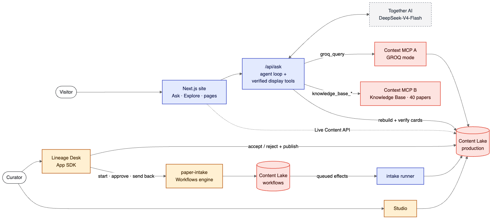
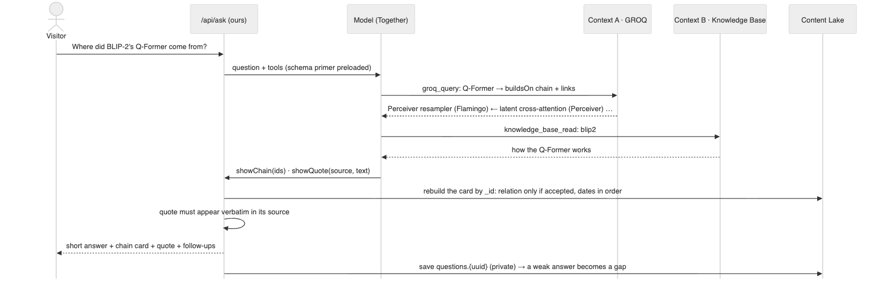
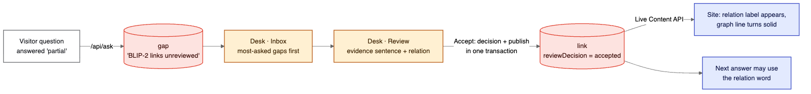
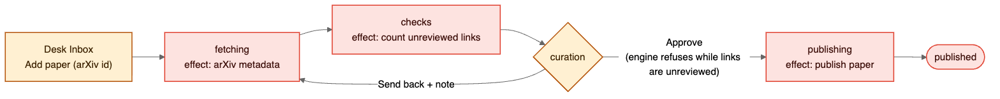

# Paper Lineage: every AI idea has ancestors

## What I Built

Open BLIP-2's Q-Former in Paper Lineage and you get its ancestry as a chain you can check:

> **Bahdanau attention (2014) → Transformer (2017) → Set Transformer (2018) → Perceiver (2021) → Flamingo (2022) → BLIP-2 (2023)**
> Perceiver: *"Most closely related to our work is the Set Transformer."*
> Flamingo: *"…a Perceiver-based architecture that can produce a small fixed number of visual tokens…"*

Every hop is a citation mined from the later paper's full text, with the sentence it used. Ask the chat the same question and it answers from that same data.

**The problem.** Citation graphs tell you *that* B cites A, not *how* B built on A. LLMs fill that gap with plausible verbs ("B extends A"). In research lineage, a plausible verb is often wrong.

**The solution: separate facts from interpretation, and enforce it.**
- **Fact:** B cites A *n* times, in these sections, with these sentences. Mined, never edited.
- **Interpretation:** B *extends / reuses / challenges* A. Shown **only after a curator accepts it.**

Until then the site, the graph and the chat say "cites ×5", never "extends". The chat's server enforces this, not the prompt.

**The dataset:** 197 papers traced three generations back from BLIP-2; 1,349 citation links, each with its citing sentences; 25 themes and 180 concepts; and 52 curated "builds-on" links between ideas, each checked against publication dates.

**Three surfaces on one Sanity dataset:**

| Who | Where | Does what |
|---|---|---|
| Visitor | Website (Next.js) | Asks questions; explores the graph, papers and concepts |
| Curator | **Lineage Desk** (Sanity App SDK) | Accepts or rejects links with the evidence beside them; triages visitor questions; writes stories |
| New papers | **paper-intake** (Sanity Workflows) | Fetch metadata → count links → curator approval → publish |

## Demo

- **Live:** https://paper-lineage-xi.vercel.app
- **Video:** _(link)_. It covers Ask → Explore → Desk review → workflow approval. The Desk and Studio need a Sanity login, so they're shown in the video.
- **Try asking:** "Where did BLIP-2's Q-Former come from?" · "How does the Q-Former use learnable queries?"
- **Status:** _N_ of 1,349 links verified so far. Curation is ongoing, and every unverified link shows as "cites ×n", by design.

## Code

https://github.com/akashgoyal/paper-lineage. The repo has `web/` (site + Ask), `studio/`, `desk/` (App SDK), `workflows/` (definition + runner) and `scripts/` (harvest → curate → seed). `docs/BUILD_LOG.md` is the full build log.

## How it works

### Architecture

Colours: **red** = Sanity service · **orange** = our code running on Sanity · **blue** = our code (Vercel, laptop) · **grey** = third party.



### Example 1: a visitor asks a question



The model never writes a card. It passes ids to a display tool, and the server rebuilds the card from Sanity. Anything unverifiable goes back to the model as an error instead of reaching the visitor: an unknown id, papers out of order, an inexact quote, or a relation on an unreviewed link.

### Example 2: a curator verifies a link



### Example 3: a new paper (Workflows)



The approval gate is in the workflow definition, not the UI. When the gate holds, the Desk shows the engine's reason ("16 links are still unreviewed").

### The schema (where facts and interpretation live)

```js
// influence-2201-12086-2301-12597: BLIP → BLIP-2 (real document, trimmed)
{
  from: {_ref: "paper-2201-12086"},          // BLIP
  to:   {_ref: "paper-2301-12597"},          // BLIP-2
  citation: {                                 // FACT: read-only, mined from BLIP-2's full text
    mentions: 9, methodMentions: 3,
    contexts: [ /* 4 sentences: Introduction, Related Work, Method ×2 */
      {_key: "c2", section: "Method",
       text: "Inspired by BLIP (Li et al. 2022), we jointly optimize three pre-training objectives…"} ]
  },
  evidenceKey: "c2",                          // INTERPRETATION: the sentence that best supports…
  relation: "extends",                        // …this relation. Public only once accepted.
  provenance: {origin: "harvest", suggestedRelation: "extends", confidence: 0.95, reviewDecision: "proposed"}
}
```

Public queries read interpretation only through `select(provenance.reviewDecision == "accepted" => relation)`, and a unit test fails if any query skips that gate. Full texts and visitor questions sit on **private id paths** (`paperText.*`, `questions.*`), unreadable to public queries on a public dataset.

## How I Used Sanity

**Why this needs structured content:** "where did the Q-Former come from?" isn't a keyword lookup. It's a walk over typed references: concept → `buildsOn` → earlier concept → `introducedBy` → paper → the `influence` link between those papers → its review status. Keyword search over the PDFs finds papers that *mention* the Perceiver, not the chain or whether it's verified.

| Feature | Used for |
|---|---|
| **Context MCP, GROQ mode** | The agent's structural answers: who built on whom, when, how often cited, verified or not. A `groqFilter` keeps full texts and visitor data out |
| **Knowledge Base** + Context MCP (KB mode) | The "how / why / what results" answers, from 40 core papers. Created, imported and built with the `sanity context` CLI |
| **App SDK** | The Lineage Desk: live document hooks, accept/reject published in one transaction with Undo, batched triage |
| **Workflows** | `paper-intake` defined as data: stages, effects, an approval gate the engine enforces, a send-back loop |
| Also | Content Lake + GROQ (the graph), Live Content API (accepted links appear without a redeploy), Studio (evidence and relation pickers, Accept/Reject actions), Agent Actions (Desk "Write explanation") |

**Why two Context endpoints:** one endpoint serves one mode, and a dataset source silently outranks a Knowledge Base on the same endpoint. So A answers *who / when / which / verified?*, B answers *how / why / what results*, and one answer can use both.

## My Build Process

Two days (Oct 2–3) with **Claude Code**, from an empty folder to the deployed site, Studio, Desk, workflow and Knowledge Base. I wrote the prompts; Claude Code wrote the code and the docs.

**Prompts that worked**
- *"create a new repo - start with system architecture - make most use of sanity features which are available in free version… Then create a spec before actual implementation."* Architecture and spec came first, so later prompts could be one line.
- *"Review the design spec. Is it complete… Can it be used for moving ahead with implementation"*: it found the chat had no way to choose cards, which led to the server-verified display tools.
- *"Can you do sanity checks with some API code - rather than login in claude browser?"*: every Studio and Desk query and write path is now tested against the real dataset.

**Where I had to course-correct the model**
- *"If paper apis are not working… download the pdf & analyse it on your own."* Semantic Scholar returned 429 on every call. Reading full text instead also gave a better signal: where and how often a paper is cited.
- *"In 205 papers, there are only 48 concepts."* The taxonomy was too thin. It became 25 themes and 180 concepts.
- *"The first page should be a chat-box."* The design had been browse-first.
- *"Highlight clearly in the block diagram the features used are from sanity or code."* That gave the 🟥/🟦 colour code above.

**Where the model got it wrong, and how it was caught**
- It planned Comments, Tasks and Releases, all paid-only. Caught when it checked Sanity's pricing page.
- It first modelled "Workflows" as a status field. It's a real early-access engine, so the design was rebuilt around a deployed definition.
- Data validation found **19 links where the "earlier" paper was published after the citing one** (a later revision had cited newer work). Curation had compared years, not dates. Fixed in the pipeline; the 19 links are still in production as unreviewed, for a curator to reject.
- A `loading.tsx` file made unknown pages return 200 instead of 404. Caught with curl on a made-up slug.
- A GROQ sort on an expression type-checked but failed against the real API. Caught by the script that runs every Desk query against production.
- Workflow effect bindings turned out to be GDR URIs, not ids, so the first intake failed with "paper not found".
- **Changing the chat model.** My credits were on Together AI. Gemma, my first pick, isn't offered there for tool calling. I tested the cheapest models through the real agent loop:
  - Qwen3.5-9B returned empty answers.
  - GLM-5.3-Flash kept searching and never answered.
  - gpt-oss-120b printed its reasoning as the answer.
  - **DeepSeek-V4-Flash worked, at about 1¢ per answer.**
  
  The tests also showed it narrating ("Let me show…"), repeating itself and over-producing cards. The fixes went into code (card limits, filters), not the prompt.
- **The quote that kept failing.** Knowledge Base quotes kept failing the word-for-word check. It turned out the entries are Sanity's *summaries* of the papers, not their words, so quoting them as "from BLIP-2" would have been wrong. They're now captioned "Knowledge Base summary of BLIP-2".

**Cut:** AI-proposed links (links come from the full-text harvest); Sanity Functions (Free-plan schedules run daily, and hosted workflow runtimes aren't available yet, so a small runner drains effects); a path-finder page; live cursors in the story composer.

**Not verified:** the Desk, Studio and Agent Actions buttons were never clicked by the agent, because they need a Sanity login. Their queries and write paths were tested by scripts against the real dataset.

## Sanity Project Details

- **Project ID:** `jd22zcim`. Dataset `production` is public: [first five papers](https://jd22zcim.api.sanity.io/v2025-02-19/data/query/production?query=*[_type=="paper"][0...5]{shortName,publishedAt})
- **Schema:** `paper`, `influence` (fact / interpretation / review), `concept` (theme → concept, `buildsOn`), `storyline`, `gap`, and private `paperText.*` and `questions.*`
- **Studio** (curators): https://paper-lineage.sanity.studio · **Desk:** an app in the Sanity Dashboard

## Agent Session

_(link to the exported Claude Code session, made public)_
