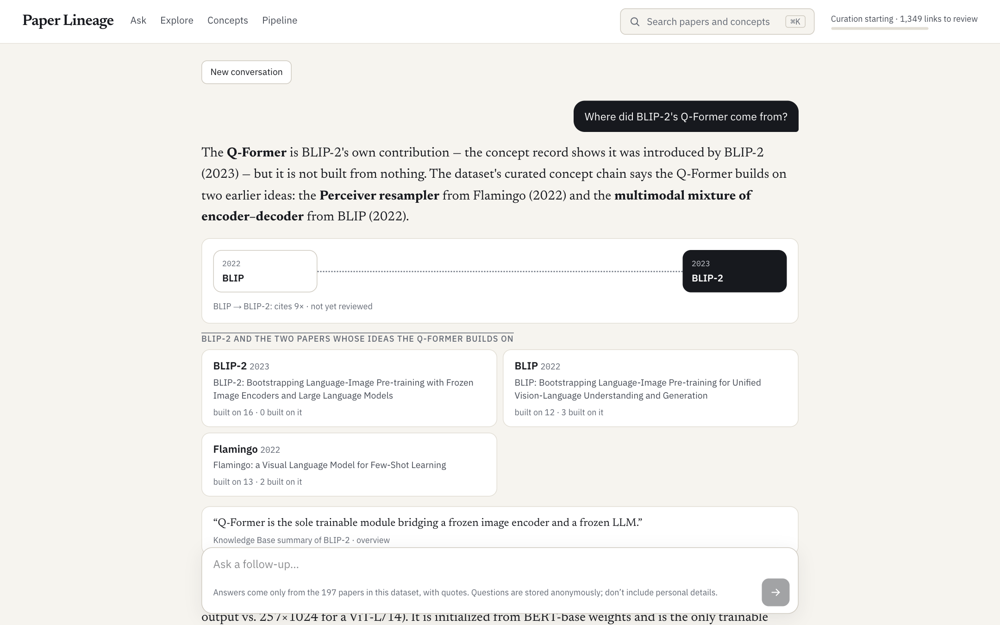
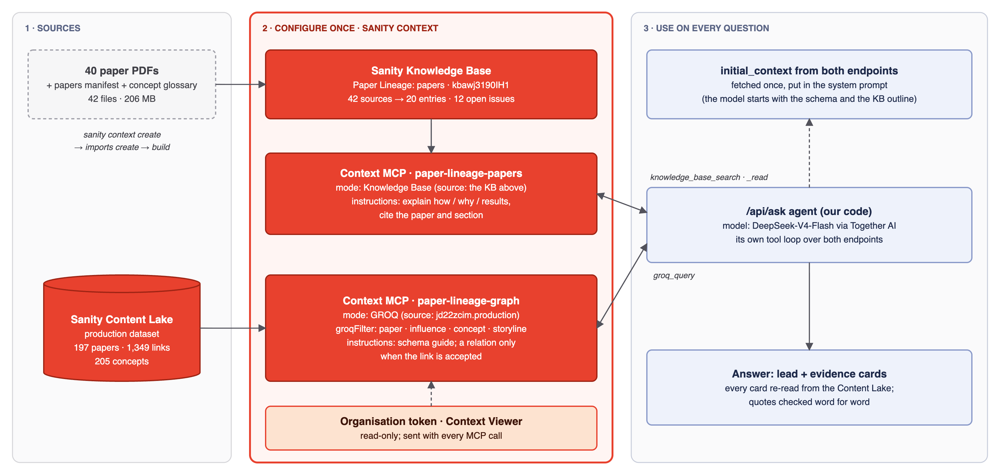
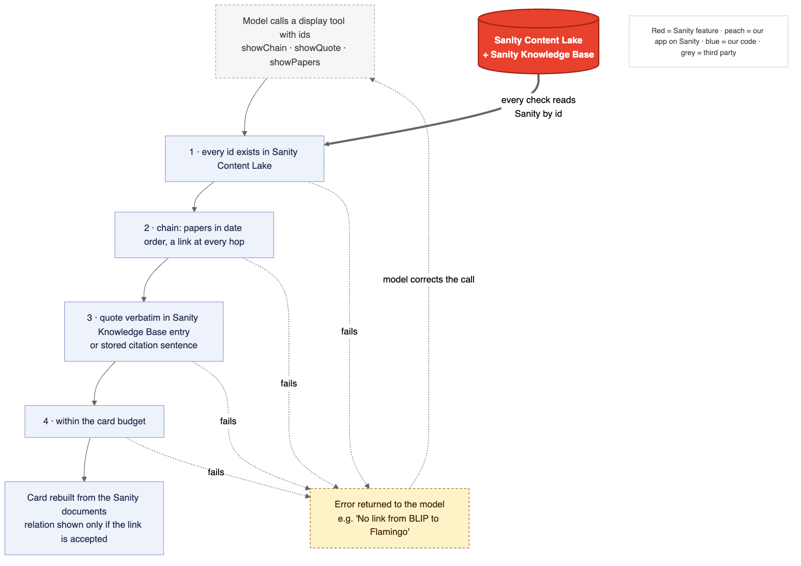

*This is a submission for the [Sanity Challenge, Path One: Ship an Agent That Queries Real Content](https://dev.to/challenges/sanity-2026-09-16)*

## What I Built

**The problem.** Ask an AI tool "where did BLIP-2's Q-Former come from?" and it answers from memory, with plausible verbs: *"it extends Flamingo's resampler…"*. Citation graphs say **that** one paper cites another, not **how** it built on it, and nothing tells you which verb is wrong.

**The agent.** Paper Lineage's Ask answers lineage questions about AI research from **Sanity Context**, over 197 papers and 1,349 citation links. It shows its evidence as cards rebuilt from Sanity, not as model-written prose, and it says "cites 9×" until a curator has verified a relation like "extends".

| Agent capability | Sanity product | Advantage |
|---|---|---|
| Structural answers: who built on whom, when, how often cited, verified or not | **Sanity Context MCP, GROQ mode** over the lineage graph | The model writes real GROQ against typed references; no vector database to build |
| "How does it work / why / what results" | **Knowledge Base** via Context MCP (40 papers → 20 entries) | Upload PDFs; Sanity builds and serves the entries |
| Evidence the visitor can trust | **Content Lake**: every card re-read by id, relations gated on review | A relation reaches the screen only if a curator accepted it |
| Answers that get better | **Content Lake** (questions on a private id path, gaps) + a curator app on the **App SDK** | Weak answers become curation tasks |

**Why this needs structured content.** "Where did the Q-Former come from?" isn't a keyword lookup. It's a walk over typed references:

> concept `Q-Former` → `buildsOn` → `Perceiver resampler` → `introducedBy` → Flamingo (2022) → the `influence` link Flamingo → BLIP-2 → its citation count, sentences and review status

Keyword search over the PDFs finds papers that *mention* the Perceiver. It can't return the chain, or whether a curator has verified each hop.

## Demo

**Live:** https://paper-lineage-xi.vercel.app (the home page is the agent)

Try: "Where did BLIP-2's Q-Former come from?" · "What did CLIP build on?" · "How does the Q-Former use learnable queries?"


*The chain says "cites 9×, not yet reviewed": no curator has accepted that link yet. The quote is captioned as a Knowledge Base summary, not the paper's words.*

## Code

https://github.com/akashgoyal/paper-lineage. The agent is [`web/src/lib/ask/agent.ts`](https://github.com/akashgoyal/paper-lineage/blob/main/web/src/lib/ask/agent.ts) (tool loop and MCP client) and [`web/src/lib/ask/tools.ts`](https://github.com/akashgoyal/paper-lineage/blob/main/web/src/lib/ask/tools.ts) (display tools and verification).

## How I Used Sanity

### What I pointed Sanity Context at



| Endpoint | Mode | Source | Answers |
|---|---|---|---|
| **A** `paper-lineage-graph` | GROQ | dataset `production`, with `groqFilter: _type in ["paper","influence","concept","storyline"]` | who / when / which / how often / verified? |
| **B** `paper-lineage-papers` | Knowledge Base | Knowledge Base `kbawj3190IH1`: 40 core papers (PDF) + a manifest + a concept glossary → **20 entries** (BLIP-2, frozen-LM interfaces, BLIP/ALBEF, CLIP/ALIGN, ViT, MAE…) | how does it work / why / what results |

- **The graph (A):** 197 papers, 1,349 citation links (each with its citing sentences, counts and sections), 205 concepts and 52 curated `buildsOn` links between ideas, harvested from full text three generations back from BLIP-2. The filter keeps full texts and visitor questions out of the agent's reach; they also sit on private id paths.
- **The Knowledge Base (B):** created, imported and built with the `sanity context` CLI from 42 sources, well inside the 150-document beta limit.
- **Why two endpoints:** one endpoint serves one mode, and a dataset source silently outranks a Knowledge Base on the same endpoint.

### Which Sanity Context tools the agent uses

| Tool | How |
|---|---|
| `initial_context` (A and B) | Fetched once on the server and put in the system prompt, saving the model a turn |
| `groq_query` (A) | The model writes its own GROQ against a schema primer |
| `knowledge_base_search` (B) | Finds the right entry when the outline isn't enough |
| `knowledge_base_read` (B) | Reads entries by path (`blip2`, `predecessors/blip_albef`) |

`schema_explorer` and `array_field_reader` aren't offered: the schema primer covers the first, and links are small enough not to need the second.

### What the agent does with the content it retrieves

One real run of "Where did BLIP-2's Q-Former come from?", unedited apart from line breaks:

```text
→ groq_query       *[_type=="paper" && shortName match "BLIP-2"]{_id, shortName, title, publishedAt}
→ groq_query       *[_type=="concept" && name match "Q-Former"]{_id, name, summary,
                     "by": introducedBy->{_id, shortName, publishedAt},
                     "buildsOn": buildsOn[]->{name, "by": introducedBy->{_id, shortName, publishedAt}}}
→ knowledge_base_read  {"knowledgeBase":"kbawj3190IH1","paths":["blip2"]}
→ groq_query       *[_type=="influence" && to->shortName=="BLIP-2" && (from->shortName=="Flamingo" || from->shortName=="BLIP")]
                     {_id, "from": from->{…}, "mentions": citation.mentions, "method": citation.methodMentions,
                      "decision": provenance.reviewDecision,
                      "relation": select(provenance.reviewDecision=="accepted" => relation)}
→ showChain        BLIP → BLIP-2   (concepts: multimodal mixture of encoder–decoder → Q-Former)
→ showChain        Flamingo → BLIP-2   (concepts: Perceiver resampler → Q-Former)
→ suggestFollowUps
```

The answer: the Q-Former is BLIP-2's own module, built on two earlier ideas, Flamingo's Perceiver resampler and BLIP's encoder–decoder. Both links show as "cites, not yet reviewed". A mechanism paragraph comes from the Knowledge Base, followed by four follow-ups. 3 model turns, 23 s, 0.6¢. The question is saved under a private id path, and a weak answer becomes a `gap` document that curators see in their Desk.

**The model never writes a card.**



It passes ids to a display tool (`showChain`, `showQuote`, `showPapers`, `showComparison`), and the server rebuilds the card from Sanity and checks it first:
- **ids exist** in Sanity
- **papers are in date order**, with a link at every hop of a chain
- **a quote is word for word** in the Knowledge Base entry or stored citation sentence it claims
- **the relation is stripped** unless the link is accepted

A failure goes back to the model as an error to fix, so the visitor never sees an unverified claim. In testing, a chain sent out of date order was rejected and resubmitted correctly, and a chain through a missing link was refused.

**A finding about Knowledge Bases:** entries are Sanity's **summaries** of the sources, not the sources' words. BLIP-2 says "a set number of learnable query embeddings"; the entry says "a fixed set of 32…". So Knowledge Base quotes are captioned "Knowledge Base summary of BLIP-2", and only sentences mined from a paper are shown as that paper's text.

**The rule, as a visitor sees it.** Asked "What did CLIP build on?", the agent answered:

> CLIP (2021) has 27 incoming lineage links in this dataset, but none are reviewed yet, so I can only report citation counts, not verified relations. The strongest method-level influences are **ConVIRT** (cited 5×, 4 method mentions), **Instagram hashtag pre-training** (9×, 3 method), and the vision backbones **ResNet** and **EfficientNet**.

Every number in it comes from the graph endpoint.

### Implementation notes

- **Own tool loop, any model.** About 450 lines including the MCP client, over an OpenAI-compatible API, so the model is a setting. Cheap models on Together AI, tested through the real loop:

  | Model | Result |
  |---|---|
  | Qwen3.5-9B | empty answers |
  | GLM-5.3-Flash | never stopped searching |
  | gpt-oss-120b | printed its reasoning as the answer |
  | **DeepSeek-V4-Flash** | **worked, at about 1¢ per answer** |

- **Rules enforced in code, not the prompt.** The model narrated ("Let me show…"), rewrote its lead every turn, over-produced cards and sometimes spent its whole budget on reasoning. So there's a card budget, a narration filter, a single final lead, and a nudge plus a fallback when a turn is cut off.
- **Tests.** Unit tests for verification, the stream reducer, the query gate and the narration filter, plus 6 live tests of the display tools against the real dataset. `npm run probe:ask <model> "<question>" --trace` prints every tool call.
- **Usability.** The home page is the chat. Answers are a short lead plus verified cards, follow-up chips and a sources line ("6 papers · 2 unreviewed links"). A live progress line names each Sanity lookup while it works; there's a Stop button and rate limits (Upstash).
- **Limits:** answers take 15–40 s. Curation is ongoing, so most answers say "cites". The Knowledge Base has 12 open issues (conflicting claims across papers) I haven't resolved.

## Sanity Project Details

- **Project ID:** `jd22zcim`. Dataset `production` is public: [first five papers](https://jd22zcim.api.sanity.io/v2025-02-19/data/query/production?query=*[_type=="paper"][0...5]{shortName,publishedAt})
- **Schema:** `paper`, `influence` (fact / interpretation / review), `concept` (theme → concept, `buildsOn`), `storyline`, `gap`, plus private `paperText.*` and `questions.*`
- **Context:** organisation `o2qzzix4g`; endpoints `paper-lineage-graph` (GROQ) and `paper-lineage-papers` (Knowledge Base `kbawj3190IH1`)
- The same project also powers a curator app (App SDK) and an intake workflow (Workflows), covered in my Path Two post: _(link)_

## Agent Session

_(link to the exported Claude Code session, made public)_
